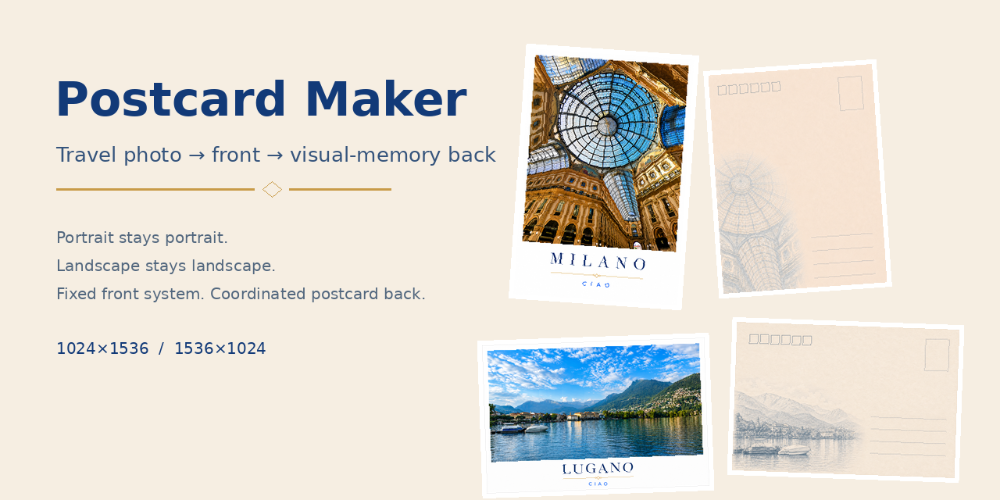
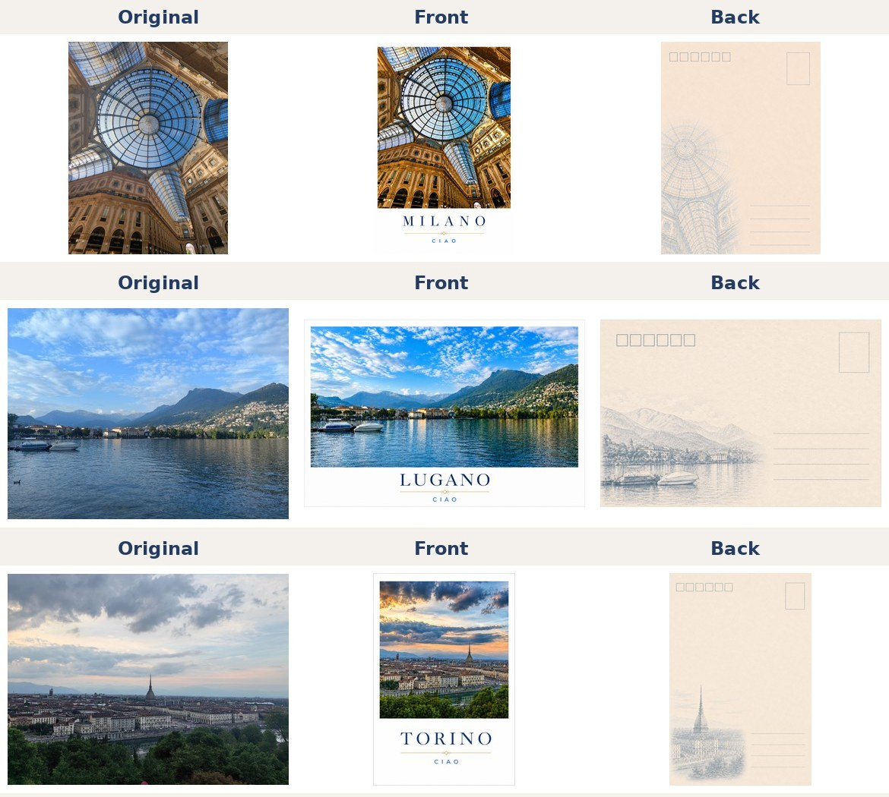
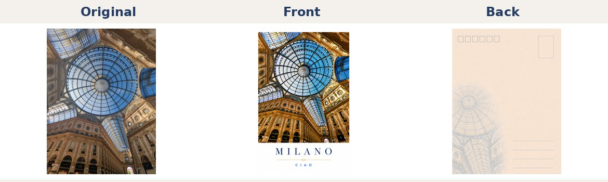
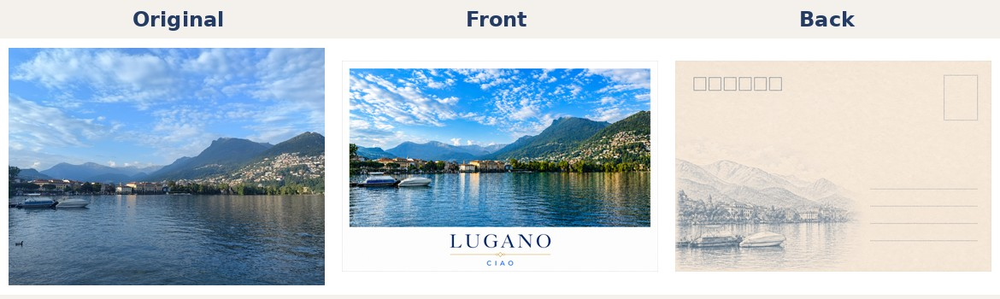
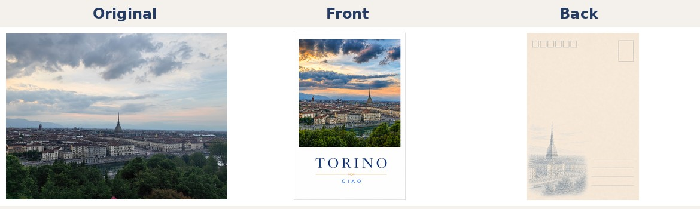

# Postcard Maker Skill



A reusable OpenAI skill for turning travel photos into coordinated, print-ready postcard fronts and backs.

> **Front:** polished travel photography.  
> **Back:** a visual memory derived from the same photograph.

## What it does

For each uploaded travel photo, Postcard Maker:

1. identifies and locks the original portrait/landscape orientation;
2. enhances the photo naturally;
3. crops it to the appropriate postcard ratio;
4. generates the fixed postcard front;
5. selects 1–3 visual-memory elements;
6. generates the coordinated postcard back;
7. runs strict QA before delivery.

## Fixed output sizes

| Orientation | Output |
|---|---:|
| Portrait | `1024 × 1536 px` |
| Landscape | `1536 × 1024 px` |

A portrait source stays portrait. A landscape source stays landscape.

## Design system

The front uses:

- clean white background;
- consistent white margins;
- sharp 90° photo corners;
- no outer frame or drop shadow;
- uppercase deep-navy serif city name;
- fixed thin warm-gold divider;
- smaller uppercase blue local greeting.

The back uses:

- warm ivory paper;
- muted blue-gray line art derived from 1–3 elements in the source image;
- exactly 6 postcode boxes;
- 1 empty stamp frame;
- exactly 4 address lines;
- no center divider;
- no city/country label.

## Visual examples



### Milano



### Lugano



### Torino



The public example originals in this repository are re-saved copies with EXIF metadata stripped.

## Using this as an OpenAI Skill

The skill follows the standard skill-folder structure: a root `SKILL.md`, plus optional references, assets, and `agents/openai.yaml`.

### ChatGPT

On ChatGPT accounts/workspaces where Skills are available, open the Skills interface, choose **Create**, then **Upload from your computer**, and upload the skill package. Review the skill before installing it.

### Codex

For repository-scoped use, place the skill folder under:

```text
.agents/skills/postcard-maker/
```

Codex discovers repository skills from `.agents/skills`.

### GitHub

GitHub is the versioned source of this project. Clone or download the repository, then install/copy the skill into a supported OpenAI environment.

## Example prompts

```text
把这张旅行照片做成明信片，正面和背面都生成。
```

```text
这张是在 Porto 拍的。保持原来的横竖方向，做成明信片。
```

```text
把这几张照片做成同一套明信片，每张都保持原始方向。
```

```text
这张背面的四条地址线稍微加深一点，其他地方不要改。
```

More examples are in [`references/usage-examples.md`](references/usage-examples.md).

## Repository structure

```text
postcard-maker-skill/
├── SKILL.md
├── README.md
├── LICENSE
├── CHANGELOG.md
├── agents/
│   └── openai.yaml
├── assets/
│   ├── postcard-icon.svg
│   ├── postcard-icon-large.png
│   └── preview/
├── examples/
│   ├── README.md
│   ├── before/
│   └── after/
└── references/
    ├── photo-processing.md
    ├── front-design.md
    ├── back-design.md
    ├── greetings.md
    ├── operational-workflow.md
    ├── usage-examples.md
    └── github-publishing.md
```

## Core references

- [`photo-processing.md`](references/photo-processing.md): image analysis, enhancement, and crop protection.
- [`front-design.md`](references/front-design.md): front layout and typography.
- [`back-design.md`](references/back-design.md): back layout and visual-memory illustration.
- [`greetings.md`](references/greetings.md): approved city/greeting pairs.
- [`operational-workflow.md`](references/operational-workflow.md): compact execution checklist.
- [`github-publishing.md`](references/github-publishing.md): maintainer release checklist.

## Print guidance

Recommended finished size:

```text
100 × 150 mm
```

Suggested production settings:

- 300 dpi;
- 3 mm bleed;
- 5 mm internal safe margin.

For a 100 × 150 mm finished postcard with bleed, prepare approximately:

```text
106 × 156 mm artwork
```

## Design philosophy

The system is intentionally restrained:

> minimal travel photography on the front, visual memory on the back.

Consistency takes priority over unnecessary stylistic variation.

## Contact

Questions, feedback, collaboration, and permission requests are welcome.

**Email:** [meixlin9366@gmail.com](mailto:meixlin9366@gmail.com)

## License & commercial use

This project is publicly available for **personal, educational, academic, research, and other non-commercial use**.

**Commercial use is not permitted without prior written permission.**

Commercial use includes selling the project or modified versions, integrating it into a paid product or service, charging users for access to a service substantially based on it, or otherwise using it primarily for commercial advantage or monetary compensation.

For commercial licensing or other permission requests, contact:

**meixlin9366@gmail.com**

See [`LICENSE`](LICENSE) for the full project terms.

> Note: because this project restricts commercial use, it is source-available rather than OSI-approved open-source software.
